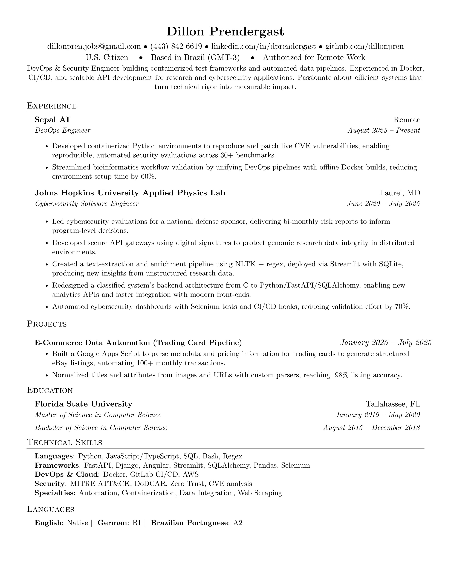

# Resume
LaTeX template and build tooling for my personal resume.

Based off of [jakegut/resume](https://github.com/jakegut/resume)

### Build locally
Requirements:
- `latexmk` (recommended) or `pdflatex`
- ImageMagick (`magick` or `convert`) for JPG generation

Commands from the repo root:

```bash
make           # builds PDF and JPG
make pdf       # builds Resume_DillonPrendergast.pdf
make jpg       # builds Resume.jpg from the PDF
make template  # builds Resume_Template.pdf and Resume_Template.jpg
make template-pdf
make template-jpg
make clean     # removes build artifacts
```

Notes:
- LaTeX source lives in the private submodule `resume-source/resume.tex`.
- Outputs are written to `Resume_DillonPrendergast.pdf` and `Resume.jpg` at the repo root.
 - Template outputs are `Resume_Template.pdf` and `Resume_Template.jpg` at the repo root.

### Public template
This repository includes a public template with dummy data: `resume-template.tex`.

To preview the template:

```bash
pdflatex -interaction=nonstopmode -halt-on-error resume-template.tex
```

Or open it in Overleaf.


